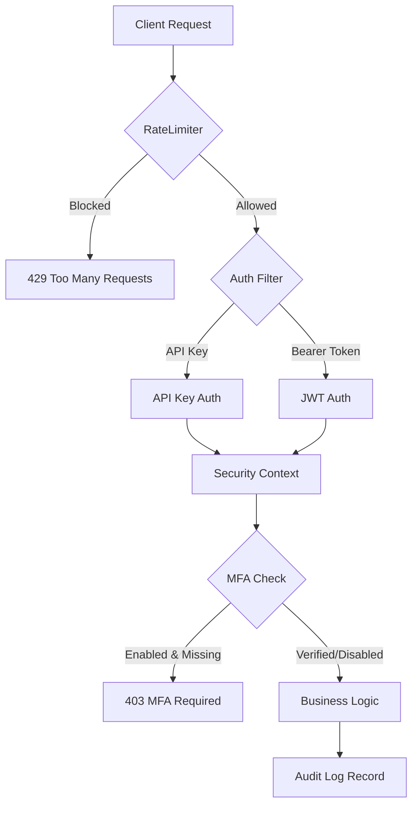

# 🛡️ SecurityHub — Enterprise Identity & Access Management (IAM)

SecurityHub is a high-performance, production-ready IAM suite built on **Spring Boot 3.2** and **Java 21**. It provides a unified platform for multi-tenant authentication, granular authorization, and real-time security surveillance. The system features a state-of-the-art glassmorphism dashboard for seamless administration.

---

## 🏗️ System Architecture

### 1. High-Level Blueprint
SecurityHub follows a **Micro-kernel Architecture** where security filters act as interceptors for every transaction.
- **Traffic Layer**: Manages IP-based rate limiting and blacklisting using Token Bucket algorithms.
- **Identity Layer**: Decouples authentication (Login/MFA) from authorization (RBAC/PBAC).
- **Persistence Layer**: Implements multi-tenant data isolation at the Row-Level via `tenant_id`.
- **Surveillance Layer**: Non-blocking asynchronous audit logging with JSONB metadata storage.

### 2. The Identity Chain


---

## 💎 Premium Features & Technology Stack

### Core Backend (Java 21 / Spring Boot 3.2)
- **JWT (RS256)**: Asymmetric signing for ultra-secure, stateless sessions.
- **Multi-tenancy**: Seamless organization boundaries with isolated data domains.
- **Advanced RBAC**: Granular permission scopes (e.g., `USER_WRITE`, `AUDIT_READ`) with stabilized JPA identity.
- **Adaptive MFA**: TOTP-based protection (Google Authenticator, Authy) with mandatory enforcement logic.
- **Rate Limiting**: Per-IP and per-API-key throttling using **Bucket4j**.
- **Flyway Migrations**: Automated, version-controlled database schema evolution.

### Administrative Command Center (Vite / Vanilla JS)
- **Glassmorphism Design**: High-fidelity, translucent UI for a professional "Security Mainframe" feel.
- **Custom Notification Engine**: Replaces native browser dialogs with themed success, warning, and error cards.
- **Performance Optimized**: Vanilla JS implementation with Vite for near-instant page loads and zero bundle bloat.
- **Real-time Analytics**: Chart.js integration for authentication traffic and role distribution monitoring.
- **Pagination Engine**: Efficient handling of large security registries (Users, Roles, Audit Logs).

---

## 🔧 Deployment & Hardening Guide

### 1. System Requirements
- **Java 21 Development Kit (JDK)**: Utilizes modern language features and security enhancements.
- **PostgreSQL 15+**: Primary relational datastore with JSONB support for audit logs.
- **Node.js 18.x / 20.x**: For building and running the management dashboard.
- **Maven 3.8+**: Project lifecycle management.
- **OpenSSL**: Required for generating the 2048-bit RSA keypair.

### 2. Secure Configuration
1. Initialize the environment:
   ```bash
   cp .env.example .env
   ```
2. **Critical Security Step**: Generate your RSA Keys. **DO NOT** skip this or use public keys.
   - **Windows**: `.\generate-keys.bat`
   - **Linux/Unix**: `chmod +x generate-keys.sh && ./generate-keys.sh`
   This creates `private.pem` and `public.pem` in `src/main/resources/keys/`.

3. Update `.env` with your PostgreSQL string:
   `SPRING_DATASOURCE_URL=jdbc:postgresql://localhost:5432/authdb`

### 3. Execution Protocol
#### Launching the Mainframe (Backend)
```bash
mvn clean spring-boot:run
```
- **Base API**: `http://localhost:8080/api/v1`
- **Health Check**: `http://localhost:8080/actuator/health`
- **Swagger Documentation**: `http://localhost:8080/swagger-ui/index.html`

#### Launching the Dashboard (Frontend)
```bash
cd dashboard-web
npm install
npm run dev
```
- **Access URL**: `http://localhost:5173`
- **Default Login**: 
  - Tenant: `default`
  - User: `admin`
  - Pass: `Admin@123`

---

## 🛡️ Security Operations Manual

### 1. MFA Setup & Enforcement
SecurityHub treats MFA as a first-class citizen. 
- If `MFA_REQUIRED` is set in the property file, users cannot perform sensitive actions without an active TOTP.
- The dashboard provides a "2FA Induction" flow with QR code generation and instant verification.

### 2. Audit Trail Investigation
Every security event (login failures, role updates, key revocations) is recorded with:
- **Actor Identity**: Who performed the action.
- **Timestamp & IP**: Precise tracing of the event origin.
- **Transaction Details**: What changed and the resulting status.
- **Tenant Context**: Ensures logs are visible only to the respective organization admin.

### 3. Identity Lifecycles
New identities can be initialized with **pre-assigned roles** during creation to ensure immediate productivity under strict access control. The primary identifier is an immutable UUID, though profile details (names, contact info) can be updated as needed.

---

## 📊 Technical Reference

### Persistence Model
- **Tenants**: Virtual organizations.
- **Users**: Security identities tied to a tenant.
- **Roles**: Collection of permissions (e.g., `ROLE_ADMIN`).
- **Permissions**: Atomic access scopes (e.g., `ROLE_WRITE`).
- **IP Rules**: Blacklist/Whitelist entries for global traffic control.

---

## 🧪 Testing & Quality Assurance
For exhaustive API test scripts (PowerShell/cURL), security verification steps, and troubleshooting guides, please refer to:
👉 **[TESTING.md](./TESTING.md)**

---

## 📁 Intelligence Directory Structure
```
SecurityHub/
├── src/main/java/com/auth/
│   ├── config/       # Security & Framework Orchestration
│   ├── controller/   # API Entry Points
│   ├── domain/       # Identity Objects & JPA Entities
│   ├── dto/          # Data Transfer Objects
│   ├── repository/   # Data Access Layer
│   ├── security/     # Cryptography, Filters, & MFA Logic
│   └── service/      # Security Business Intelligence
├── src/main/resources/
│   ├── db/migration/ # Flyway SQL Evolution
│   └── keys/         # RSA Enclave (Gitignored)
└── dashboard-web/    # Administrative Command Center (Vite)
```


