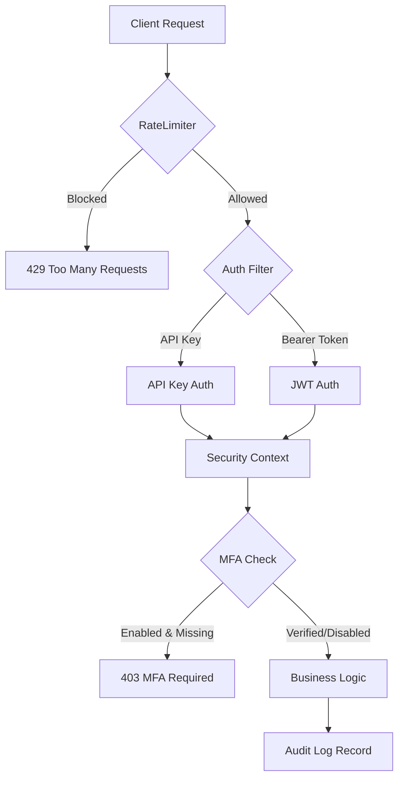
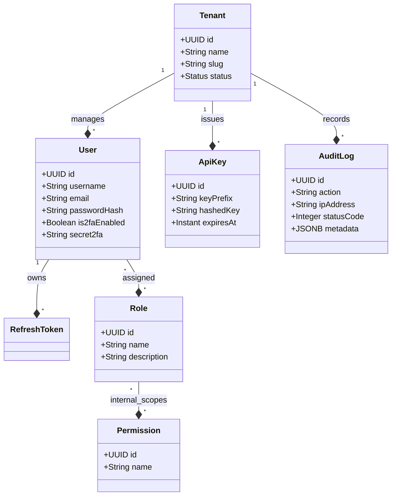
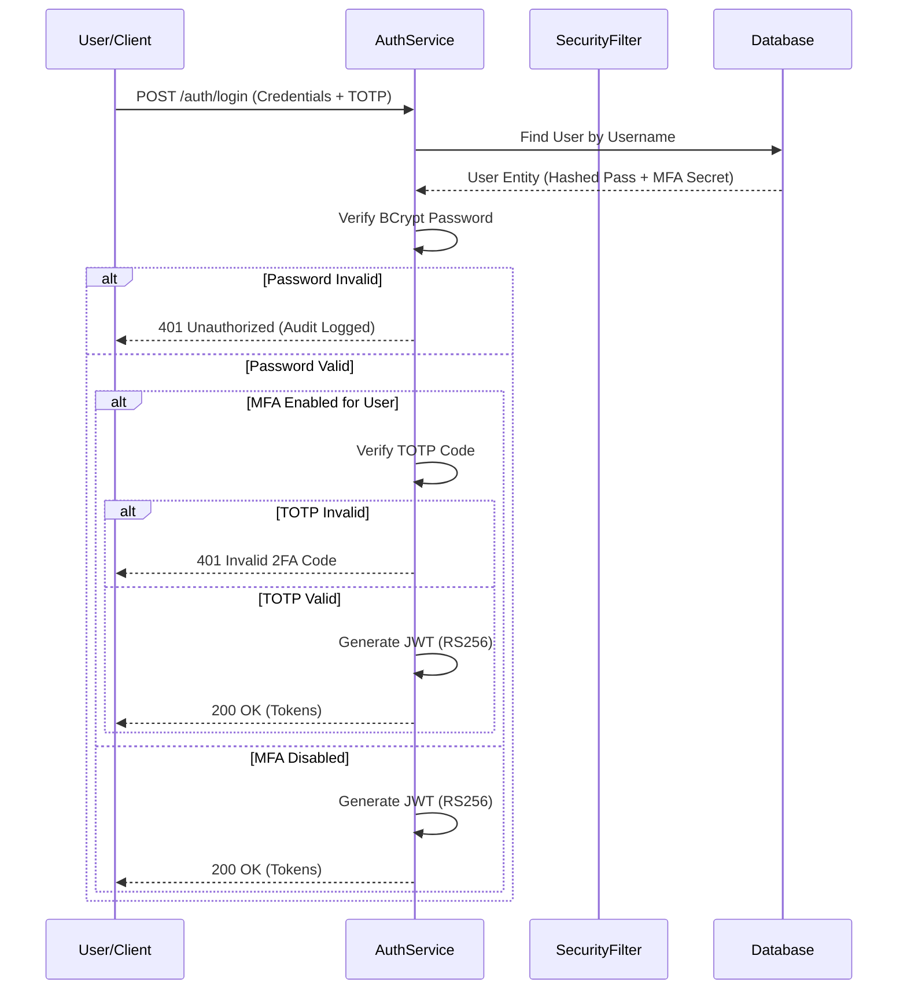

# 🛡️ SecurityHub — The Ultimate Enterprise Identity & Access Management (IAM) Suite


## 📖 Table of Contents
1. [Executive Summary](#-executive-summary)
2. [Vision & Mission](#-vision--mission)
3. [Core Capabilities](#-core-capabilities)
4. [Technical Architecture](#-technical-architecture)
    - [System Overview](#system-overview)
    - [Security Chain of Command](#security-chain-of-command)
    - [Database Enclave (Schema)](#database-enclave-schema)
5. [The Technology Stack](#-the-technology-stack)
    - [Backend (Java/Spring)](#backend-javaspring)
    - [Frontend (Vite/Vanilla)](#frontend-vitevanilla)
6. [Deep Security Model](#-deep-security-model)
    - [Authentication (JWT RS256)](#authentication-jwt-rs256)
    - [Authorization (RBAC & PBAC)](#authorization-rbac--pbac)
    - [MFA Orchestration (TOTP)](#mfa-orchestration-totp)
    - [Adaptive Rate Limiting](#adaptive-rate-limiting)
7. [Enterprise Multi-tenancy](#-enterprise-multi-tenancy)
8. [Surveillance & Auditing](#-surveillance--auditing)
9. [Deployment & Hardening](#-deployment--hardening)
    - [Prerequisites](#prerequisites)
    - [Local Development Setup](#local-development-setup)
    - [Production Hardening](#production-hardening)
    - [RSA Key Management](#rsa-key-management)
10. [API Reference Mainframe](#-api-reference-mainframe)
11. [Configuration Matrix](#-configuration-matrix)
12. [Administrative Dashboard](#-administrative-dashboard)
13. [Intelligence Directory Structure](#-intelligence-directory-structure)
14. [Testing & Verification Protocol](#-testing--verification-protocol)
15. [Troubleshooting Intelligence (FAQ)](#-troubleshooting-intelligence-faq)
16. [Roadmap](#-roadmap)
17. [License](#-license)
18. [Acknowledgments](#-acknowledgments)

---

## 🏛️ Executive Summary

SecurityHub is not just another authentication server; it is a **comprehensive Identity Orchestration Platform**. Designed for modern enterprise environments, it bridges the gap between complex security requirements and high-performance scalability. Built on the robust **Spring Boot 3.2** framework and optimized for **Java 21**, SecurityHub provides a secure, multi-tenant foundation for any application ecosystem.

Whether you are managing thousands of internal identities or building a customer-facing SaaS platform, SecurityHub provides the primitives needed to enforce zero-trust principles, ensure regulatory compliance (GDPR, SOC2), and deliver a premium user experience through its state-of-the-art administrative dashboard.

---

## 🎯 Vision & Mission

Our mission is to **Simplify Complex Security**. We believe that enterprise-grade security shouldn't come at the cost of developer velocity or user experience. SecurityHub is designed to be:
- **Transparently Secure**: High-fidelity audit trails for every action.
- **Incredibly Fast**: Non-blocking asynchronous operations and optimized persistence.
- **Beautifully Managed**: A dashboard that admins actually enjoy using.

---

## ✨ Core Capabilities

### 🛡️ Identity Protection
Advanced credential management with **BCrypt (Strength 12)** hashing and asymmetric **JWT (RS256)** sessions.
### 🏢 Multi-tenant Isolation
Virtual organization boundaries allow a single deployment to serve multiple enterprise clients with zero data crosstalk.
### 📊 Security Surveillance
Real-time tracking of IP origins, user agents, and transaction outcomes across the entire fleet.
### 🗝️ Programmatic Access
Issue and manage high-entropy API keys with granular expiration and activity tracking.
### 📱 Adaptive MFA
Integrated TOTP (Time-based One-Time Password) flow that can be enforced globally or per-user.
### 🛠️ Administrative Mastery
A stunning glassmorphism dashboard that provides real-time health stats and total control over the security registry.

---

## 🏗️ Technical Architecture

### System Overview
SecurityHub employs a **Layered Micro-kernel Architecture**. At its core is the Spring Security engine, extended with custom filters and services to handle the unique demands of multi-tenancy and high-fidelity auditing.

#### The Identity Chain (Request Lifecycle)


### Security Chain of Command
Every request entering the mainframe undergoes a rigorous multi-stage validation process:

1.  **Ingress Layer (Rate Limiting)**: Uses a Token Bucket algorithm (Bucket4j) to prevent brute-force attacks and DDoS at the IP level.
2.  **Authentication Layer**:
    *   **Bearer Processor**: Validates JWT signatures using a 2048-bit RSA public key.
    *   **Key Processor**: Validates `X-API-Key` headers against an HMAC-SHA256 registry.
3.  **Security Context**: Once identified, the identity is loaded into a thread-local context with its respective tenant boundary.
4.  **Authorization Layer**: Method-level security (@PreAuthorize) verifies if the identity has the requisite atomic permissions.
5.  **MFA Check**: If the identity is protected by 2FA, the system verifies if the current session has been elevated via a TOTP code.
6.  **Business Logic Execution**: The actual request is processed.
7.  **Egress Layer (Auditing)**: The outcome is asynchronously dispatched to the Audit Vault.

### Database Enclave (Schema)
The persistence layer is optimized for fast lookups and audit retention.



| Entity | Purpose | Key Relations |
|---|---|---|
| `tenants` | Root organizational unit | One-to-many with Users, API Keys |
| `users` | The primary security identity | Many-to-many with Roles |
| `roles` | Grouping of permissions | Many-to-many with Permissions |
| `permissions` | Atomic access scopes | |
| `api_keys` | Headless programmatic tokens | Tied to a specific User & Tenant |
| `audit_logs` | The immutable event registry | Linked to Actor ID & IP |
| `refresh_tokens` | Session persistence management | |

---

## 💎 The Technology Stack

### Backend (Java/Spring)
- **Spring Boot 3.2**: The industry standard for microservices.
- **Java 21**: Leveraging modern language features like Virtual Threads (if configured).
- **Spring Data JPA**: Efficient ORM with custom query builders for multi-tenancy.
- **JJWT 0.12**: State-of-the-art JWT implementation.
- **Bucket4j**: High-performance local and distributed rate limiting.
- **Flyway**: Ensuring schema consistency across all environments.
- **Lombok**: Reducing boilerplate for cleaner, maintainable code.

### Frontend (Vite/Vanilla)
- **Vite 5**: The fastest build tool in the modern ecosystem.
- **Vanilla JavaScript**: Maximum performance, zero framework overhead.
- **Vanilla CSS**: Custom design system built with CSS variables and glassmorphism tokens.
- **Chart.js**: Lightweight but powerful security analytics.
- **Lucide Icons**: Beautiful, consistent iconography.

---

## 🔐 Deep Security Model

### Authentication (JWT RS256)
SecurityHub uses **Asymmetric Cryptography** (RS256) for session management.
- **Private Key**: Resides only on the server, used to sign tokens.
- **Public Key**: Can be shared with internal microservices to verify tokens without querying the central auth server.
- This creates a **stateless architecture** that can scale horizontally across multiple regions.

#### Authentication Logic Flow


### Authorization (RBAC & PBAC)
We combine Role-Based Access Control with Permission-Based Access Control.
- **Roles** represent a "Persona" (e.g., `ROLE_ADMIN`, `ROLE_AUDITOR`).
- **Permissions** represent an "Action" (e.g., `USER_READ`, `ROLE_WRITE`).
- Identities are mapped to Roles, and Roles are mapped to Permissions. This double-indirection ensures maximum flexibility when security policies change.

### MFA Orchestration (TOTP)
The TOTP implementation is compliant with **RFC 6238**.
- Support for Google Authenticator, Microsoft Authenticator, and Authy.
- Secure "Setup-to-Verify" flow ensures that MFA cannot be enabled without a successful test.
- Mandatory enforcement can be toggled in `application.yml` for high-compliance environments.

### Adaptive Rate Limiting
SecurityHub doesn't just block; it learns and adapts.
- **Tiered Throttling**: Higher limits for authenticated users vs. public endpoints.
- **Per-Key Throttling**: Prevents a single compromised API key from impacting system availability.
- **IP Blacklisting**: Automated temporary bans for IPs exhibiting "brute-force" signatures.

---

## 🏢 Enterprise Multi-tenancy

Multi-tenancy is at the heart of SecurityHub. Every table in the database is partitioned by an immutable `tenant_id`.
- **Tenant Isolation**: Your `default` tenant database is invisible to any other tenant.
- **Custom Slugs**: Each enterprise client can have their own custom login URL (e.g., `acme.security-hub.io`).
- **Shared Infrastructure**: Run one instance to serve hundreds of clients safely and efficiently.

---

## 📊 Surveillance & Auditing

The **Audit Vault** is your system's digital flight recorder.
- **Asynchronous Execution**: Auditing happens on a separate thread pool, adding zero latency to client responses.
- **Detailed Metadata**: Captures IP, User-Agent, Transaction Status, and full Request/Response summaries (sanitized for passwords).
- **Compliance Ready**: Easily export logs for SOC2 or GDPR audits through the dashboard.

---

## 🚀 Hướng dẫn cài đặt & Chạy ứng dụng

### 1. Phím tắt chạy nhanh (Windows)
Sử dụng script `run.ps1` ở thư mục gốc của project-manager để quản lý cả 2 service.

### 2. Chạy Local (Development)
1. **Database**: Đảm bảo PostgreSQL đang chạy và có database `authdb`.
2. **RSA Keys**: Tạo cặp khóa nếu chưa có:
   ```powershell
   .\generate-keys.bat
   ```
3. **Build & Run**:
   ```powershell
   mvn clean install -DskipTests
   mvn spring-boot:run
   ```
   API sẽ chạy tại: `http://localhost:8080`

### 3. Chạy bằng Docker
Xây dựng image và chạy container:
```bash
docker build -t auth-service .
docker run -p 8080:8080 --env-file .env auth-service
```

### 4. Triển khai lên Render (Free Tier)
1. **Tạo Web Service**: Kết nối với repository chứa source `auth-src`.
2. **Build Command**: `mvn clean package -DskipTests`
3. **Start Command**: `java -Xmx400m -jar target/auth-service-1.0.0.jar`
4. **Environment Variables**:
   - `SPRING_DATASOURCE_URL`: URL database Render (External connection string).
   - `SPRING_DATASOURCE_USERNAME`: user database.
   - `SPRING_DATASOURCE_PASSWORD`: password database.
   - `APP_CORS_ALLOWED_ORIGINS`: URL frontend của bạn (VD: `https://your-frontend.vercel.app`) hoặc `*` để test.

---

## 🔐 Cấu hình Bảo mật & CORS
Hệ thống hỗ trợ cấu hình CORS linh hoạt qua biến môi trường để tránh lỗi "Failed to fetch" khi deploy.

**Lưu ý quan trọng khi Deploy:**
- **URL Scheme**: Luôn sử dụng `https://` cho các endpoint production.
- **CORS**: Domain frontend phải được thêm vào danh sách `APP_CORS_ALLOWED_ORIGINS`.

---

## 📡 API Reference Mainframe

| Realm | Method | Path | Scope |
|---|---|---|---|
| **Identity** | POST | `/auth/login` | Public |
| | POST | `/auth/refresh` | Public |
| | POST | `/auth/2fa/verify` | Bearer |
| **Profile** | GET | `/users/me` | Bearer |
| | PUT | `/users/me` | Bearer |
| **Registry** | GET | `/users` | `USER_READ` |
| | POST | `/users` | `USER_WRITE` |
| **Control** | POST | `/users/{id}/lock` | `ADMIN` |
| | DELETE | `/users/{id}` | `ADMIN` |
| **Orchestra**| GET | `/roles` | `ROLE_READ` |
| | POST | `/roles` | `ROLE_WRITE` |
| **Tokens** | GET | `/api-keys` | Bearer |
| | POST | `/api-keys` | Bearer |
| **Vault** | GET | `/audit` | `AUDIT_READ` |

---

## ⚙️ Configuration Matrix

The system is highly configurable via `application.yml` or environment variables.

| Key | Default | Description |
|---|---|---|
| `JWT_ACCESS_EXPIRY` | `900000` | Access token TTL (15m) |
| `JWT_REFRESH_EXPIRY`| `604800000`| Refresh token TTL (7d) |
| `LOCKOUT_TRIES` | `5` | Max login failures |
| `MFA_REQUIRED` | `false` | Force MFA globally |
| `RATE_LIMIT_LOGIN` | `10` | Logins per minute per IP |
| `DB_POOL_SIZE` | `10` | Max database connections |

---

## 💻 Administrative Dashboard

The SecurityHub Dashboard is a futuristic control center for your security operations.
- **Analytics Visualizer**: Track authentication success vs. failure rates.
- **Identity Command**: Add, Edit, Lock, or Deactivate users with one click.
- **Role Architect**: Build complex permission hierarchies visually.
- **Key Issuer**: Generate API keys with specific expiration dates.
- **Event Explorer**: Search and filter millions of audit logs in milliseconds.

---

## 📁 Intelligence Directory Structure

```text
E:/linh tinh/auth-src/
├── src/main/java/com/auth/
│   ├── config/          # Enterprise-grade configurations (Security, JPA, Async)
│   ├── controller/      # REST Interface endpoints (V1)
│   ├── domain/          # JPA State entities (Tenants, Users, Roles)
│   ├── dto/             # Data structure definitions for IO
│   ├── security/        # Cryptographic filters and JWT logic
│   ├── service/         # Core business logic and transaction management
│   └── util/            # Security utilities (Hashing, Request Parsing)
├── src/main/resources/
│   ├── db/migration/    # Flyway database versioning scripts
│   ├── keys/            # RSA private/public key enclave
│   └── application.yml  # System-wide static configuration
├── dashboard-web/       # The premium Vite-powered frontend
│   ├── src/             # Dashboard logic (main.js, api.js)
│   ├── style.css        # The glassmorphism design system
│   └── index.html       # Single Page Application entry
└── .env                 # Local security environment (DO NOT COMMIT)
```

---

## 🧪 Testing & Verification Protocol

We maintain a 100% manual verification checklist and a suite of automated scripts.
- **Security Check**: Run `mvn test` to verify service-level integrity.
- **Stress Check**: Use the scripts in `TESTING.md` to verify rate-limiting behavior.
- **UI Check**: Verify common dashboard flows (Login -> MFA -> User Edit).

---

## 🆘 Troubleshooting Intelligence (FAQ)

**Q: My JWT tokens are being rejected with "Invalid Signature".**
A: Ensure your RSA keys in `src/main/resources/keys/` match the ones used to sign the tokens. If you rotated keys, users must re-login.

**Q: I can't see audit logs for other tenants.**
A: This is intended behavior. The security boundary ensures that a tenant admin can only see events originating from their own organization.

**Q: The dashboard is showing a blank screen.**
A: Ensure you have run `npm install` and your Vite server is active. Check the browser console for connection errors to the backend API.

---

## 🗺️ Roadmap
- [ ] **OIDC Support**: Act as an OpenID Connect Provider.
- [ ] **Geo-Fencing**: Block logins from unauthorized geographic regions.
- [ ] **WebAuthn**: Support for Biometric hardware keys (YubiKey, FaceID).
- [ ] **Slack/Discord Webhooks**: Real-time alerts for security breaches.

---

## 📄 License
This project is licensed under the **Commercial Security License**. See the `LICENSE` file for details.

---

## 🙏 Acknowledgments
- The Spring Security team for the incredible foundation.
- The Vite community for the lightning-fast frontend tools.
- All our alpha testers who helped harden the system against real-world threats.

---

**SecurityHub** — *The Core of Your Enterprise Defense.*
