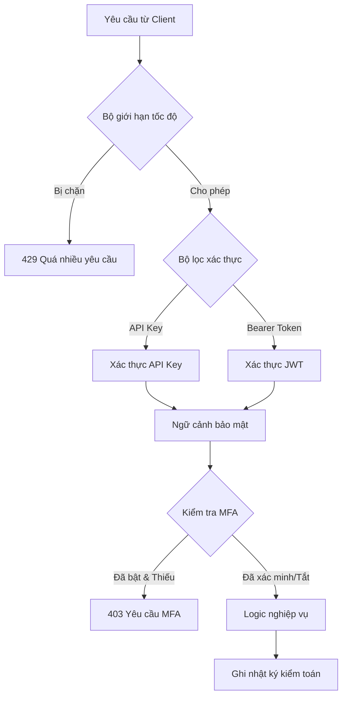
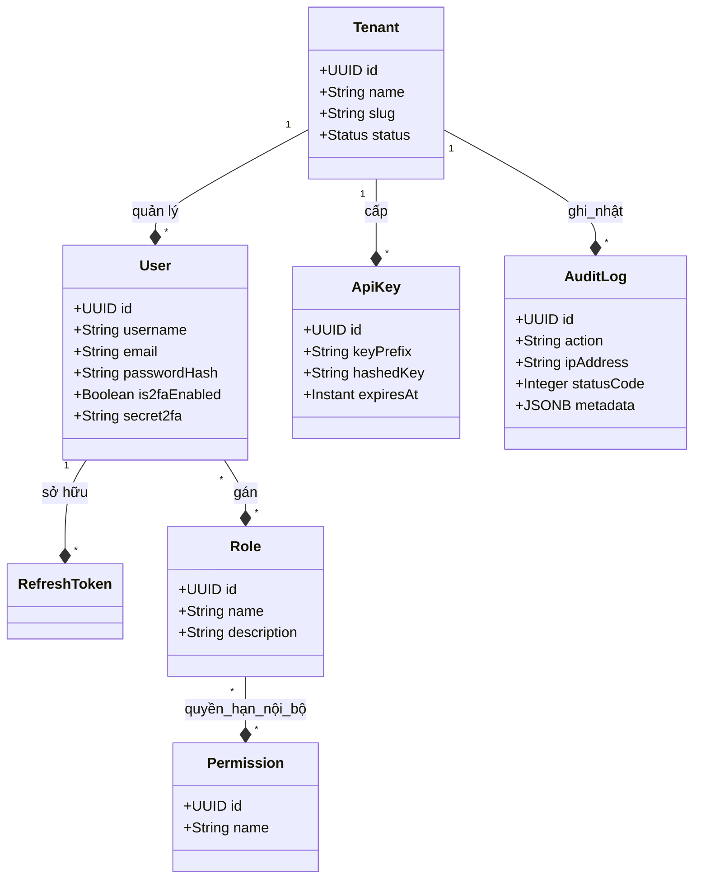
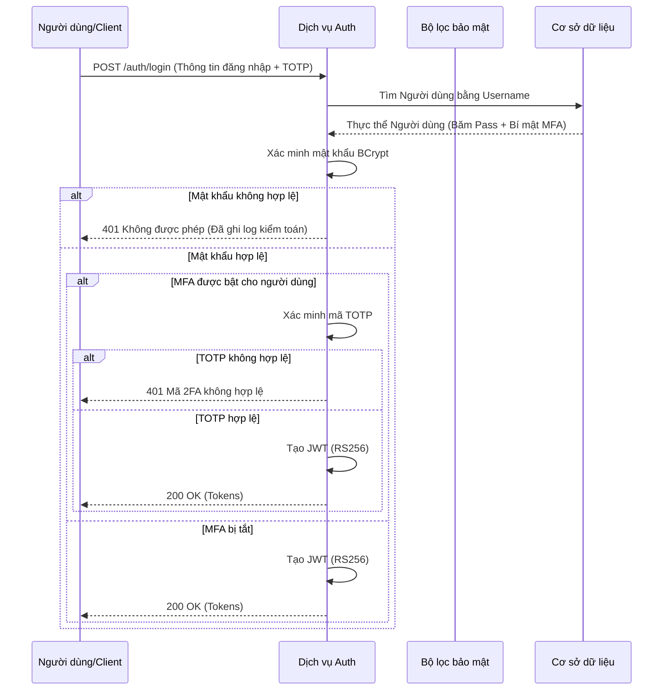

# 🛡️ SecurityHub — Bộ Quản lý Định danh & Truy cập (IAM) Doanh nghiệp Toàn diện


## 📖 Mục lục
1. [Tóm tắt điều hành](#-tóm-tắt-điều-hành)
2. [Tầm nhìn & Sứ mệnh](#-tầm-nhìn--sứ-mệnh)
3. [Khả năng cốt lõi](#-khả-năng-cốt-lõi)
4. [Kiến trúc kỹ thuật](#-kiến-trúc-kỹ-thuật)
    - [Tổng quan hệ thống](#tổng-quan-hệ-thống)
    - [Chuỗi mệnh lệnh bảo mật](#chuỗi-mệnh-lệnh-bảo-mật)
    - [Sơ đồ dữ liệu (Schema)](#sơ-đồ-dữ-liệu-schema)
5. [Công nghệ sử dụng](#-công-nghệ-sử-dụng)
    - [Backend (Java/Spring)](#backend-javaspring)
    - [Frontend (Vite/Vanilla)](#frontend-vitevanilla)
6. [Mô hình bảo mật chuyên sâu](#-mô-hình-bảo-mật-chuyên-sâu)
    - [Xác thực (JWT RS256)](#xác-thực-jwt-rs256)
    - [Phân quyền (RBAC & PBAC)](#phân-quuyền-rbac--pbac)
    - [Điều phối MFA (TOTP)](#điều-phối-mfa-totp)
    - [Giới hạn tốc độ thích ứng](#giới-hạn-tốc-độ-thích-ứng)
7. [Đa người thuê (Multi-tenancy)](#-đa-người-thuê-multi-tenancy)
8. [Giám sát & Kiểm toán](#-giám-sát--kiểm-toán)
9. [Triển khai & Bảo mật](#-triển-khai--bảo-mật)
    - [Điều kiện tiên quyết](#điều-kiện-tiên-quyết)
    - [Cài đặt phát triển local](#cài-đặt-phát-triển-local)
    - [Bảo mật sản xuất](#bảo-mật-sản-xuất)
    - [Quản lý khóa RSA](#quản-lý-khóa-rsa)
10. [Danh mục API](#-danh-mục-api)
11. [Ma trận cấu hình](#-ma-trận-cấu-hình)
12. [Bảng điều khiển quản trị](#-bảng-điều- khiển-quản-trị)
13. [Cấu trúc thư mục](#-cấu-trúc-thư-mục)
14. [Quy trình kiểm thử](#-quy-trình-kiểm-thử)
15. [Câu hỏi thường gặp (FAQ)](#-câu-hỏi-thường-gặp-faq)
16. [Lộ trình phát triển](#-lộ-trình-phát-triển)

---

## 🏛️ Tóm tắt điều hành

SecurityHub không chỉ là một máy chủ xác thực; nó là một **Nền tảng Điều phối Định danh toàn diện**. Được thiết kế cho môi trường doanh nghiệp hiện đại, nó thu hẹp khoảng cách giữa các yêu cầu bảo mật phức tạp và khả năng mở rộng hiệu suất cao. Xây dựng trên framework **Spring Boot 3.2** mạnh mễ và tối ưu cho **Java 21**, SecurityHub cung cấp nền tảng đa người thuê an toàn cho bất kỳ hệ sinh thái ứng dụng nào.

Cho dù bạn đang quản lý hàng ngàn định danh nội bộ hay xây dựng một nền tảng SaaS hướng tới khách hàng, SecurityHub cung cấp các công cụ cần thiết để thực thi các nguyên tắc zero-trust, đảm bảo tuân thủ quy định (GDPR, SOC2) và mang lại trải nghiệm người dùng cao cấp thông qua bảng điều khiển quản trị hiện đại.

---

## 🎯 Tầm nhìn & Sứ mệnh

Sứ mệnh của chúng tôi là **Đơn giản hóa Bảo mật Phức tạp**. Chúng tôi tin rằng bảo mật cấp doanh nghiệp không nên đánh đổi bằng tốc độ phát triển của lập trình viên hay trải nghiệm người dùng. SecurityHub được thiết kế để:
- **Bảo mật minh bạch**: Nhật ký kiểm toán độ tin cậy cao cho mọi hành động.
- **Tốc độ cực nhanh**: Các hoạt động không đồng bộ không chặn và lưu trữ tối ưu.
- **Quản lý tinh tế**: Một bảng điều khiển mà các quản trị viên thực sự yêu thích.

---

## ✨ Khả năng cốt lõi

### 🛡️ Bảo vệ định danh
Quản lý thông tin đăng nhập nâng cao với băm **BCrypt (Strength 12)** và phiên **JWT (RS256)** không đối xứng.
### 🏢 Cách ly đa người thuê
Ranh giới tổ chức ảo cho phép một lần triển khai phục vụ nhiều khách hàng doanh nghiệp mà không bị trùng lặp dữ liệu.
### 📊 Giám sát bảo mật
Theo dõi thời gian thực IP nguồn, user agent và kết quả giao dịch trên toàn bộ hệ thống.
### 🗝️ Truy cập theo chương trình
Cấp và quản lý các khóa API entropy cao với xác thực **chữ ký HMAC-SHA256** bảo mật, bảo vệ chống phát lại **X-Timestamp** bắt buộc và theo dõi hoạt động chi tiết.
### 📱 MFA thích ứng
Luồng TOTP (Mật khẩu một lần dựa trên thời gian) tích hợp có thể được thực thi toàn cầu hoặc theo từng người dùng.
### 🛠️ Quản trị tối ưu
Bảng điều khiển glassmorphism tuyệt đẹp cung cấp số liệu thống kê sức khỏe thời gian thực và toàn quyền kiểm soát sổ đăng ký bảo mật.

---

## 🏗️ Kiến trúc kỹ thuật

### Tổng quan hệ thống
SecurityHub sử dụng **Kiến trúc Micro-kernel Phân lớp**. Cốt lõi là Spring Security engine, được mở rộng với các bộ lọc và dịch vụ tùy chỉnh để xử lý các yêu cầu duy nhất của đa người thuê và kiểm toán độ tin cậy cao.

#### Chuỗi định danh (Vòng đời yêu cầu)


### Chuỗi mệnh lệnh bảo mật
Mọi yêu cầu đi vào hệ thống đều trải qua quy trình xác thực nhiều giai đoạn nghiêm ngặt:

1.  **Lớp Ingress (Giới hạn tốc độ)**: Sử dụng thuật toán Token Bucket (Bucket4j) để ngăn chặn tấn công brute-force và DDoS ở cấp độ IP.
2.  **Lớp Xác thực**:
    *   **Bộ xử lý Bearer**: Xác thực chữ ký JWT bằng khóa công khai RSA 2048-bit.
    *   **Bộ xử lý Key**: Xác thực các tiêu đề `X-API-Key`, `X-Timestamp`, và `X-Signature`. Sử dụng HMAC-SHA256 cho tính toàn vẹn và bảo vệ chống phát lại dựa trên dấu thời gian. Được tối ưu hóa với **Hibernate JOIN FETCH** để phân giải quyền tốc độ cao.
3.  **Ngữ cảnh bảo mật**: Sau khi được xác định, định danh được tải vào ngữ cảnh thread-local với ranh giới người thuê tương ứng.
4.  **Lớp Phân quyền**: Bảo mật cấp phương thức (@PreAuthorize) xác minh xem định danh có các phạm vi quyền nguyên tử cần thiết hay không.
5.  **Kiểm tra MFA**: Nếu định danh được bảo vệ bởi 2FA, hệ thống sẽ xác minh xem phiên hiện tại đã được nâng cấp qua mã TOTP hay chưa.
6.  **Thực thi logic nghiệp vụ**: Yêu cầu thực tế được xử lý.
7.  **Lớp Egress (Kiểm toán)**: Kết quả được gửi không đồng bộ đến Kho lưu trữ kiểm toán.

### Sơ đồ dữ liệu (Schema)
Lớp lưu trữ được tối ưu hóa cho tra cứu nhanh và lưu trữ kiểm toán.



---

## 💎 Công nghệ sử dụng

### Backend (Java/Spring)
- **Spring Boot 3.2**: Tiêu chuẩn ngành cho microservices.
- **Java 21**: Tận dụng các tính năng ngôn ngữ hiện đại.
- **Spring Data JPA**: ORM hiệu quả với trình tạo truy vấn tùy chỉnh cho đa người thuê.
- **JJWT 0.12**: Triển khai JWT hiện đại nhất.
- **Bucket4j**: Giới hạn tốc độ hiệu suất cao cục bộ và phân tán.
- **Flyway**: Đảm bảo tính nhất quán của schema trên mọi môi trường.
- **Lombok**: Giảm mã lặp lại cho mã sạch hơn, dễ bảo trì hơn.

### Frontend (Vite/Vanilla)
- **Vite 5**: Công cụ build nhanh nhất trong hệ sinh thái hiện đại.
- **Vanilla JavaScript**: Hiệu suất tối đa, không tốn chi phí framework.
- **Vanilla CSS**: Hệ thống thiết kế tùy chỉnh với biến CSS và token glassmorphism.
- **Chart.js**: Phân tích bảo mật nhẹ nhưng mạnh mẽ.
- **Lucide Icons**: Bộ biểu tượng đẹp và nhất quán.

---

## 🔐 Mô hình bảo mật chuyên sâu

### Xác thực (JWT RS256)
SecurityHub sử dụng **Mật mã học không đối xứng** (RS256) để quản lý phiên.
- **Khóa riêng (Private Key)**: Chỉ nằm trên máy chủ, được sử dụng để ký token.
- **Khóa công khai (Public Key)**: Có thể được chia sẻ với các microservices nội bộ để xác minh token mà không cần truy vấn máy chủ auth trung tâm.
- Điều này tạo ra một **kiến trúc không trạng thái (stateless)** có thể mở rộng theo chiều ngang.

#### Luồng logic xác thực


---

- [English](README.md) | [Tiếng Việt](README_VI.md) | [中文](README_ZH.md)

---

## 🚀 Hướng dẫn cài đặt & Chạy ứng dụng

### 1. Phím tắt chạy nhanh (Windows)
Sử dụng script `run.ps1` ở thư mục gốc của project-manager để quản lý cả 2 service.

### 2. Chạy Local (Development)
1. **Database**: Đảm bảo PostgreSQL đang chạy và có database `authdb`.
2. **Environment**: Sao chép file mẫu và cấu hình các biến cần thiết:
   ```bash
   cp .env.example .env
   ```
3. **RSA Keys**: Tạo cặp khóa nếu chưa có:
   ```powershell
   .\generate-keys.bat
   ```
4. **Build & Run**:
   ```powershell
   mvn clean install -DskipTests
   mvn spring-boot:run
   ```
   API sẽ chạy tại: `http://localhost:8080`

### 3. Chạy bằng Docker
```bash
docker build -t auth-service .
docker run -p 8080:8080 --env-file .env auth-service
```

### 4. Triển khai trên Máy chủ Riêng (VPS / Dedicated Server)
Dành cho việc tự lưu trữ hoặc triển khai nội bộ:

1.  **Chuẩn bị Môi trường**: Cài đặt Docker và Nginx.
2.  **Cấu hình**:
    - Thiết lập file `.env` với thông tin cơ sở dữ liệu sản xuất.
    - Đảm bảo các khóa RSA trong thư mục `keys/` đã được tạo.
3.  **Khởi chạy**:
    ```bash
    docker build -t auth-service .
    docker run -d --name auth-service -p 8080:8080 --env-file .env auth-service
    ```
4.  **Reverse Proxy (Nginx)**: Cấu hình Nginx để xử lý SSL và điều hướng:
    ```nginx
    server {
        server_name auth.yourdomain.com;
        location / {
            proxy_pass http://localhost:8080;
            proxy_set_header Host $host;
            proxy_set_header X-Real-IP $remote_addr;
        }
    }
    ```

---

## 📡 Tài liệu API

| Realm | Method | Path | Scope |
|---|---|---|---|
| **Identity** | POST | `/auth/login` | Public |
| | POST | `/auth/refresh` | Public |
| **Tokens** | GET | `/api-keys` | Bearer |
| | POST | `/api-keys` | Bearer |

---

**SecurityHub** — *Cốt lõi của Hệ thống Phòng thủ Doanh nghiệp.*
