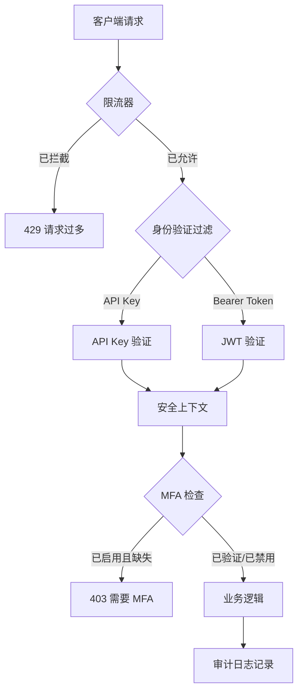
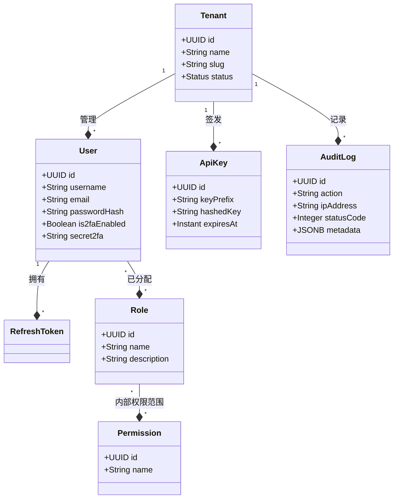
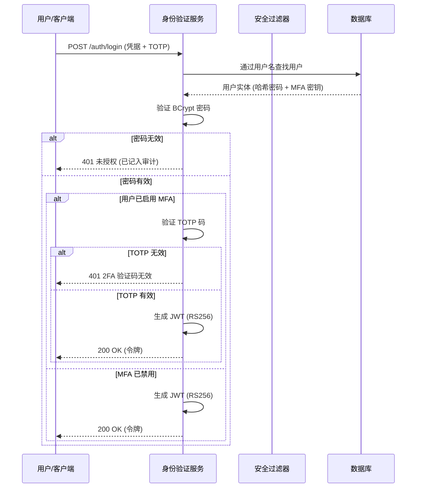

# 🛡️ SecurityHub — 终极企业级身份与访问管理 (IAM) 套件


## 📖 目录
1. [执行摘要](#-执行摘要)
2. [愿景与使命](#-愿景与使命)
3. [核心能力](#-核心能力)
4. [技术架构](#-技术架构)
    - [系统概览](#系统概览)
    - [安全逻辑链](#安全逻辑链)
    - [数据库设计 (Schema)](#数据库设计-schema)
5. [技术栈](#-技术栈)
    - [后端 (Java/Spring)](#后端-javaspring)
    - [前端 (Vite/Vanilla)](#前端-vitevanilla)
6. [深度安全模型](#-深度安全模型)
    - [身份验证 (JWT RS256)](#身份验证-jwt-rs256)
    - [授权 (RBAC & PBAC)](#授权-rbac--pbac)
    - [MFA 编排 (TOTP)](#mfa-编排-totp)
    - [自适应限流](#自适应限流)
7. [企业级多租户](#-企业级多租户)
8. [监控与审计](#-监控与审计)
9. [部署与加固](#-部署与加固)
    - [先决条件](#先决条件)
    - [本地开发设置](#本地开发设置)
    - [生产环境加固](#生产环境加固)
    - [RSA 密钥管理](#rsa-密钥管理)
10. [API 参考总表](#-api-参考总表)
11. [配置矩阵](#-配置矩阵)
12. [管理控制台](#-管理控制台)
13. [目录结构说明](#-目录结构说明)
14. [测试与验证协议](#-测试与验证协议)
15. [常见问题 (FAQ)](#-常见问题-faq)
16. [路线图](#-路线图)

---

## 🏛️ 执行摘要

SecurityHub 不仅仅是一个身份验证服务器；它是一个**全面的身份编排平台**。专为现代企业环境设计，它弥补了复杂安全需求与高性能扩展性之间的差距。基于强大的 **Spring Boot 3.2** 框架并针对 **Java 21** 进行了优化，SecurityHub 为任何应用生态系统提供了安全、多租户的基础。

---

## ✨ 核心能力

### 🛡️ 身份保护
使用 **BCrypt (强度 12)** 哈希和非对称 **JWT (RS256)** 会话进行高级凭据管理。
### 🏢 多租户隔离
虚拟组织边界允许单个部署支持多个企业客户，且数据完全隔离。
### 🗝️ 编程访问
签发和管理高熵 API 密钥，具有安全的 **HMAC-SHA256 签名** 验证、强制性的 **X-Timestamp** 防重放保护以及细粒度的活动跟踪。
### 🛠️ 管理掌控
惊艳的玻璃拟态仪表板，提供实时监控实时健康统计数据并完全控制安全注册表。

---

## 🏗️ 技术架构

### 系统概览
SecurityHub 采用**分层微内核架构**。其核心是 Spring Security 引擎，通过自定义过滤器和服务进行了扩展，以处理多租户和高保真审计的独特需求。

#### 身份链 (请求生命周期)


### 数据库设计 (Schema)
持久层针对快速查询和审计保留进行了优化。



---

## 🔐 深度安全模型

### 身份验证 (JWT RS256)
SecurityHub 使用 **非对称加密** (RS256) 进行会话管理。
- **私钥**: 仅保留在服务器上，用于签名令牌。
- **公钥**: 可以与内部微服务共享，以验证令牌而无需查询中央身份验证服务器。

#### 身份验证逻辑流


---

- [English](README.md) | [Tiếng Việt](README_VI.md) | [中文](README_ZH.md)

---

## 🚀 部署与运行指南

### 1. 本地开发环境
1. **数据库**: 确保 PostgreSQL 正在运行并创建了数据库 `authdb`。
2. **环境变量**: 复制模板文件并配置必要变量：
   ```bash
   cp .env.example .env
   ```
3. **RSA 密钥**: 生成密钥对：
   ```powershell
   .\generate-keys.bat
   ```
4. **构建与运行**:
   ```powershell
   mvn clean install -DskipTests
   mvn spring-boot:run
   ```
   API 将运行在: `http://localhost:8080`

### 2. 使用 Docker 运行
```bash
docker build -t auth-service .
docker run -p 8080:8080 --env-file .env auth-service
```

---

## 📡 API 参考总表

| 领域 | 方法 | 路径 | 权限范围 |
|---|---|---|---|
| **身份** | POST | `/auth/login` | 公开 |
| | POST | `/auth/refresh` | 公开 |
| **令牌** | GET | `/api-keys` | Bearer |
| | POST | `/api-keys` | Bearer |

---

**SecurityHub** — *企业防御的核心。*
